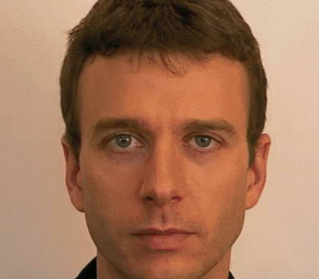

# Align-face

    
   
  

    Align face images and create video
  

## Usage 
- Put your images in `./clean_dataset` & create `./align_dataset` folder
- Run `run.bat`

## How it works
Align in a few steps:

- Detect face with Haarcascades

- Detect eyes with Haarcascades

- Add some extra padding

- Rotate, resize and crop images associated with eyes coordinate
    > According to standard face image agreed with ISO/IEC 19794-5[3]
    
- Produce video from processed images

## Contributing

Thank you for your interest in contributing! Please feel free to put up a PR for any issue or feature request.

## Give me a Star

If you think this project is helpful just give me a ⭐️ Star is enough because i don't drink coffee 😃

## License

This project is licensed under the MIT License - see the [LICENSE.md](https://github.com/moh3n9595/align-face/blob/master/LICENSE) file for details

## Author

Made with ❤️ by [Mohsen Madani](https://github.com/moh3n9595).
